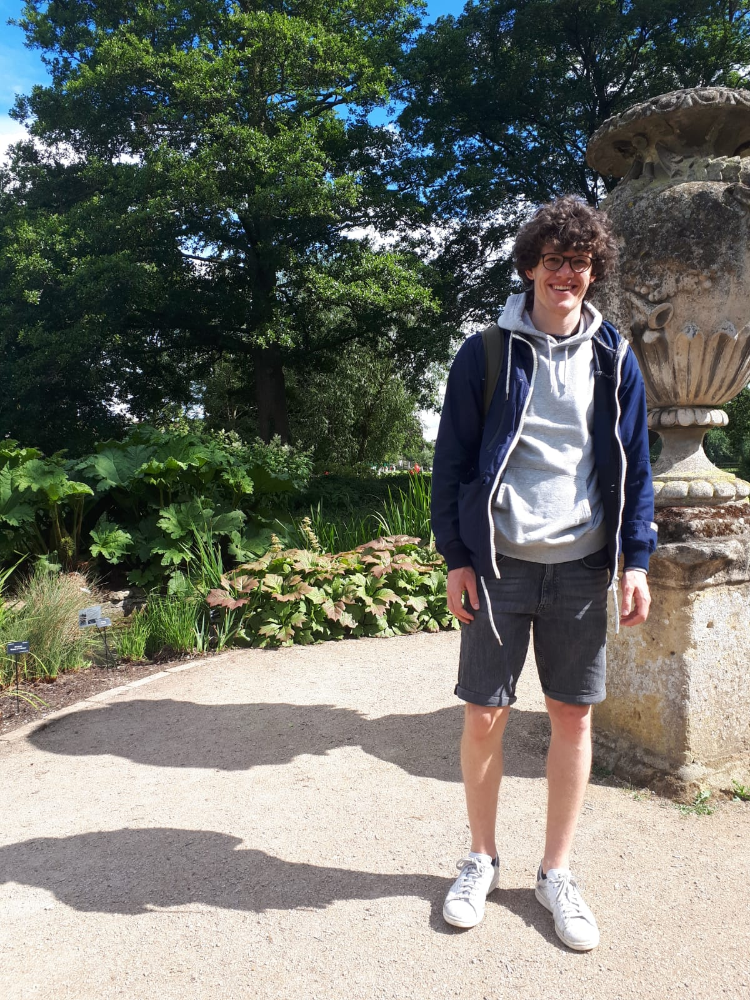

@def title = "Tim Reichelt"

~~~

  

    

    <h1 id="myname">Tim Reichelt</h1>
    

    I am a PhD student at the University of Oxford lucky to be supervised by 
    <a href="http://www.cs.ox.ac.uk/people/luke.ong/personal/">Luke Ong</a> and 
    <a href="https://www.robots.ox.ac.uk/~twgr/">Tom Rainforth</a>
    as part of the <a href="https://aims.robots.ox.ac.uk/">AIMS Centre for Doctoral Training</a>. 
    I have broad interests in probabilistic machine learning, Bayesian statistics and 
    deep learning. 
    More specifically, I do research in the field of probabilistic 
    programming languages (PPLs). The goal of PPLs is to automate inference for 
    any type of probabilistic model that could be expressed in a programming 
    language. 
    

    

    Before coming to Oxford I received a BSc (Hons) in Computer Science and 
    Artificial Intelligence from the University of Edinburgh. During my 
    undergraduate studies I did internships at Edinburgh's  
    <a href="http://statmt.org/ued/">machine translation group</a>
    and at the 
    <a href="https://www.bosch-ai.com/">Bosch Center for AI</a> in Stuttgart.
    

    <!--
    

    
    
    

    

    E-Mail: `lastname` at `robots.ox.ac.uk`
    
 
    -->
    

    <a href="https://github.com/treigerm">GitHub</a> |
    <a href="https://twitter.com/TimReichelt3">Twitter</a> |
    <a href="/assets/cv.pdf">CV</a> |
    E-Mail: `lastname` at `robots.ox.ac.uk`
    

    

    

    
    

    

    

    
Click here for a picture of me.

    
    

    

    

      
  

~~~

<!-- ~~~

<h1>News</h1>

~~~

- *Dec 2020.* Our paper "Expectation Programming" got accepted at 
  [AABI 2021](http://approximateinference.org/accepted/). Joint work with 
    [Adam Golinski](http://adamgol.me/), Luke Ong and Tom Rainforth.
- *Oct 2020*. I'm a tutor for [Bayesian Statistical Probabilistic
    Programming](http://www.cs.ox.ac.uk/teaching/courses/2020-2021/SPP/) this 
    term.
- *Sep 2020.* I started my PhD supervised by Luke Ong and Tom Rainforth.
- *Sep 2020.* Completed mini-project with Tom Rainforth.
- *Jul 2020.* Completed a mini-project with Ingmar Posner and NVIDIA.
- *Oct 2019.* Arrived in Oxford and started taking courses as part of the
  [EPSRC Centre for Doctoral Training in Autonomous Intelligent Machines and Systems](https://aims.robots.ox.ac.uk/). -->

<!-- ~~~

<h1>Publications</h1>

~~~ -->

